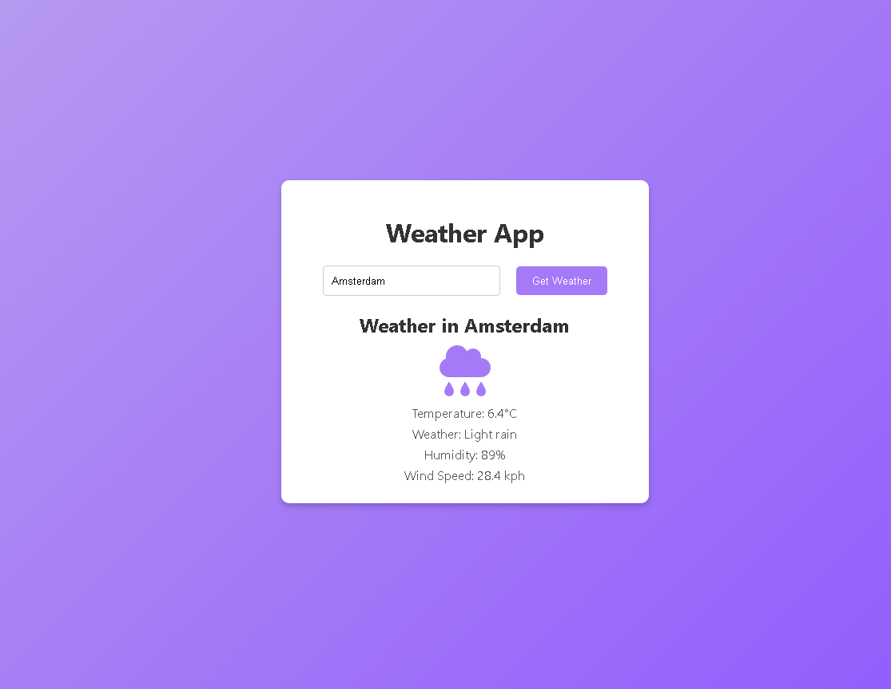

# Weather App

A simple React weather application that fetches real-time weather data using the [WeatherAPI](https://www.weatherapi.com/). The app allows users to search for a city and view its current temperature, weather conditions, humidity, and wind speed.

## Features
- Search weather by city name
- Real-time temperature and weather condition updates
- Icons representing weather conditions
- Responsive design for mobile and desktop

## Tech Stack
- **React**: Front-end library
- **WeatherAPI**: For fetching weather data, found at this site: https://www.weatherapi.com
- **Font Awesome**: For weather icons
- **CSS**: For styling

## Setup Instructions
1. Clone the repository:
   ```bash
   git clone https://github.com/nw.790/weather-app.git
2. Navigate into the project directory:
    ```bash
    cd weather-app
3. Install dependencies
    ```bash
    npm install
4. (Optional) Add your own .env file with a REACT_APP_WEATHER_API_KEY. If you don't, the app will use the default API key provided in the code:
    ```bash
    REACT_APP_WEATHER_API_KEY=your_api_key
5. Start the development server:
    ```bash
    npm start

## Demo
- 


## Future Improvements
- Add a 5-day weather forecast
- Improve UI with animations
